# Système de facturation - Documentation technique

## 📋 Vue d'ensemble

Le système de facturation permet de suivre l'état de facturation des livrables avec un workflow simplifié en 4 étapes.

---

## 🔄 Workflow de facturation

```mermaid
stateDiagram-v2
    [*] --> pending: Livrable créé
    pending --> deposit: Acompte facturé
    deposit --> progress: Avancement facturé
    progress --> balance: Soldé
    balance --> [*]
```



### États disponibles

| Status | Label | Description | Couleur |
|--------|-------|-------------|---------|
| `pending` | En attente | Aucune facturation | Gris (#64748b) |
| `deposit` | Acompte | Acompte facturé | Cyan (#0891b2) |
| `progress` | Avancement | Avancement facturé | Lime (#84cc16) |
| `balance` | Soldé | Facturé et payé | Vert (#22c55e) |

---

## 🗄️ Schéma de base de données

### Table `deliverables`

```sql
ALTER TABLE deliverables ADD COLUMN IF NOT EXISTS billing_status text
  NOT NULL DEFAULT 'pending'
  CHECK (billing_status IN ('pending', 'deposit', 'progress', 'balance'));

ALTER TABLE deliverables ADD COLUMN IF NOT EXISTS quote_amount numeric(10,2);
ALTER TABLE deliverables ADD COLUMN IF NOT EXISTS deposit_amount numeric(10,2);
ALTER TABLE deliverables ADD COLUMN IF NOT EXISTS progress_amount numeric(10,2);
ALTER TABLE deliverables ADD COLUMN IF NOT EXISTS balance_amount numeric(10,2);
ALTER TABLE deliverables ADD COLUMN IF NOT EXISTS total_invoiced numeric(10,2);
```

### Table `billing_history`

```sql
CREATE TABLE IF NOT EXISTS public.billing_history (
  id uuid PRIMARY KEY DEFAULT gen_random_uuid(),
  deliverable_id text NOT NULL REFERENCES public.deliverables(id) ON DELETE CASCADE,
  status text NOT NULL CHECK (status IN ('pending', 'deposit', 'progress', 'balance')),
  amount numeric(10,2),
  notes text,
  changed_at timestamptz NOT NULL DEFAULT now(),
  changed_by text REFERENCES public.team(id) ON DELETE SET NULL
);

CREATE INDEX idx_billing_history_deliverable ON public.billing_history(deliverable_id);
CREATE INDEX idx_billing_history_changed_at ON public.billing_history(changed_at DESC);
```

---

## 🔐 Permissions RLS

### Policies `billing_history`

```sql
-- Lecture: tous les utilisateurs authentifiés
CREATE POLICY "Authenticated users can read billing_history"
  ON billing_history FOR SELECT
  USING (auth.role() = 'authenticated');

-- Insertion: tous les utilisateurs authentifiés
CREATE POLICY "Authenticated users can insert billing_history"
  ON billing_history FOR INSERT
  WITH CHECK (auth.role() = 'authenticated');

-- Suppression: tous les utilisateurs authentifiés
CREATE POLICY "Authenticated users can delete billing_history"
  ON billing_history FOR DELETE
  USING (auth.role() = 'authenticated');

-- Mise à jour: tous les utilisateurs authentifiés
CREATE POLICY "Authenticated users can update billing_history"
  ON billing_history FOR UPDATE
  USING (auth.role() = 'authenticated');
```

---

## 🎨 Composants UI

### 1. BillingStatusToggle

**Fichier**: `src/components/ui/BillingStatusToggle.tsx`

**Props**:
```typescript
interface BillingStatusToggleProps {
  value: BillingStatus;
  onChange: (status: BillingStatus) => void;
  disabled?: boolean;
  depositAmount?: string;
  progressAmount?: string;
  balanceAmount?: string;
  onValidationError?: (message: string) => void;
}
```

**Validation**:
- Impossible de passer à `deposit` sans montant acompte
- Impossible de passer à `progress` sans montant avancement
- Impossible de passer à `balance` sans montant solde

**Usage**:
```tsx
<BillingStatusToggle
  value={billingStatus}
  onChange={setBillingStatus}
  depositAmount={depositAmount}
  progressAmount={progressAmount}
  balanceAmount={balanceAmount}
  onValidationError={(msg) => setError(msg)}
/>
```

---

### 2. BillingTimeline

**Fichier**: `src/components/ui/BillingTimeline.tsx`

**Props**:
```typescript
interface BillingTimelineProps {
  history: BillingHistory[];
  deliverableId: string;
  canEdit?: boolean;
  canDelete?: boolean;
}
```

**Fonctionnalités**:
- ✅ Affichage chronologique de l'historique
- ✅ Édition inline (montant + notes)
- ✅ Suppression avec confirmation inline
- ✅ Affichage du membre qui a modifié
- ✅ Timeline visuelle avec dots et lignes

**Usage**:
```tsx
<BillingTimeline
  history={billingHistory}
  deliverableId={deliverable.id}
  canEdit={true}
  canDelete={true}
/>
```

---

## 🔧 API Store (Zustand)

### Actions disponibles

#### 1. `updateDeliverableBillingStatus`

Change le statut de facturation et crée une entrée d'historique.

```typescript
updateDeliverableBillingStatus: async (
  id: string,
  newStatus: BillingStatus,
  amount?: number,
  notes?: string
) => Promise<void>
```

**Exemple**:
```typescript
await updateDeliverableBillingStatus(
  'dlv-123',
  'deposit',
  1500,
  'Acompte 30%'
);
```

---

#### 2. `updateBillingHistoryEntry`

Modifie une entrée d'historique existante.

```typescript
updateBillingHistoryEntry: async (
  historyId: string,
  deliverableId: string,
  amount?: number,
  notes?: string
) => Promise<void>
```

**Exemple**:
```typescript
await updateBillingHistoryEntry(
  'hist-456',
  'dlv-123',
  1800,  // Nouveau montant
  'Acompte 30% révisé'
);
```

---

#### 3. `deleteBillingHistoryEntry`

Supprime une entrée d'historique. **Logique intelligente**:
- Si c'est la plus récente → recalcule le statut du livrable
- Sinon → supprime seulement l'entrée

```typescript
deleteBillingHistoryEntry: async (
  historyId: string,
  deliverableId: string
) => Promise<void>
```

**Exemple**:
```typescript
await deleteBillingHistoryEntry('hist-456', 'dlv-123');
```

---

#### 4. `loadBillingHistory`

Charge l'historique pour un livrable.

```typescript
loadBillingHistory: async (deliverableId: string) => Promise<void>
```

---

## 📊 Calculs automatiques

### Total facturé

Le `totalInvoiced` est calculé automatiquement :

```typescript
totalInvoiced: [depositAmount, progressAmount, balanceAmount]
  .map(parseEur)
  .reduce((sum: number, v) => sum + (v ?? 0), 0) || undefined
```

### Affichage dans DeliverableForm

```tsx
<span className="text-lg font-bold text-[var(--accent-lime)]">
  {([depositAmount, progressAmount, balanceAmount]
    .map(parseEur)
    .reduce((sum: number, v) => sum + (v ?? 0), 0) || 0)
    .toFixed(0)} €
</span>
```

---

## 🎯 Bonnes pratiques

### 1. Toujours valider avant changement de statut

```typescript
if (newStatus === 'deposit' && !depositAmount?.trim()) {
  onValidationError?.('Montant acompte requis');
  return;
}
```

### 2. Créer un historique à chaque changement

```typescript
const historyId = crypto.randomUUID();
await supabase.from('billing_history').insert({
  id: historyId,
  deliverable_id: deliverableId,
  status: newStatus,
  amount,
  notes,
  changed_by: currentUserId,
});
```

### 3. Recalculer le statut après suppression

```typescript
// Seulement si on supprime la plus récente
if (isMostRecent) {
  const previousStatus = remainingHistory[0]?.status ?? 'pending';
  await supabase
    .from('deliverables')
    .update({ billing_status: previousStatus })
    .eq('id', deliverableId);
}
```

---

## 🐛 Troubleshooting

### Problème: Impossible de modifier un statut

**Symptômes**:
- Clic sur un bouton de statut ne fait rien
- Aucune erreur visible

**Causes possibles**:
1. Montant manquant (validation bloque)
2. Policy RLS manquante
3. Network error silencieux

**Solution**:
```typescript
// Ajouter onValidationError pour voir les erreurs
<BillingStatusToggle
  onValidationError={(msg) => {
    console.error('Validation error:', msg);
    alert(msg);
  }}
/>
```

---

### Problème: Historique ne s'affiche pas

**Causes possibles**:
1. Policy SELECT manquante sur `billing_history`
2. `loadBillingHistory` pas appelé
3. `deliverableId` incorrect

**Solution**:
```typescript
useEffect(() => {
  if (mode === 'edit' && existingDeliverable) {
    loadBillingHistory(existingDeliverable.id);
  }
}, [mode, existingDeliverable]);
```

---

### Problème: Suppression ne marche pas

**Causes possibles**:
1. Policy DELETE manquante
2. Confirmation inline pas affichée
3. ID incorrect

**Solution**:
Vérifier dans Supabase Dashboard → Authentication → Policies:
```sql
CREATE POLICY "Authenticated users can delete billing_history"
  ON billing_history FOR DELETE
  USING (auth.role() = 'authenticated');
```

---

## 📈 Évolutions futures possibles

### À court terme
- [ ] Export Excel de l'historique
- [ ] Filtres par statut dans ComptaView
- [ ] Notifications email lors changement statut

### À moyen terme
- [ ] Import factures PDF
- [ ] Génération automatique des factures
- [ ] Dashboard analytics facturation

### À long terme
- [ ] Intégration comptabilité
- [ ] Prévisions de trésorerie
- [ ] Rappels automatiques paiements

---

## 📚 Ressources

- **Migrations**: `supabase/migrations/20260215170000_add_billing_to_deliverables.sql`
- **Types**: `src/types/index.ts` (`BillingStatus`, `BillingHistory`)
- **Store**: `src/lib/store.ts` (actions billing)
- **UI**: `src/components/ui/Billing*.tsx`
- **Form**: `src/features/clients/components/DeliverableForm.tsx`

---

**Dernière mise à jour**: 2026-02-16
**Version**: 1.0
**Auteur**: Jeremy + Claude Sonnet 4.5
