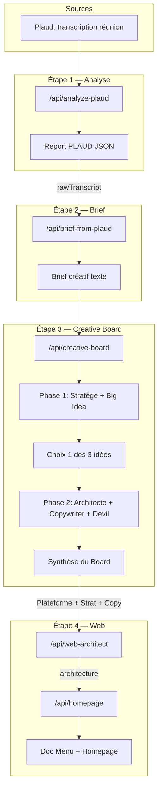

# Pipeline créatif — Documentation exhaustive

Ce document trace l'intégralité du flux créatif YAM DASH : **Plaud → Brief → Creative Board → Synthèse (analyse stratégique, plateforme de marque) → Web (menu + homepage)**.

> Voir aussi : [creative-board-outputs.md](creative-board-outputs.md) (rendu Markdown vs JSON) | [json-templates-ia.md](json-templates-ia.md) (templates Brief & Report)

---

## 1. Vue d'ensemble



---

## 2. Plaud → Report

### 2.1 Entrée

- **Transcription brute** : upload de fichier (Plaud) ou collage dans un textarea
- Point d'entrée UI : `ReportUploadModal`, `DocumentForm` (mode Report Plaud)

### 2.2 API

| | |
|---|---|
| **Route** | `POST /api/analyze-plaud` |
| **Input** | `{ transcript: string }` |
| **Output** | `ReportPlaudTemplate` (JSON) + optionnel `_meta` (coût, tokens) |
| **Modèle** | Claude Sonnet 4.5 (claude-sonnet-4-5-20250929) |

### 2.3 Schéma ReportPlaudTemplate

Cf. [src/types/document-templates.ts](../src/types/document-templates.ts) et [json-templates-ia.md](json-templates-ia.md).

```typescript
interface ReportPlaudTemplate {
  version: 1;
  title: string;
  date: string;
  duration?: number;
  participants?: string[];
  summary: string;
  keyPoints: string[];
  actionItems: { text: string; assignee?: string }[];
  nextSteps?: string;
  transcriptionExcerpt?: string;
  suggestedDeliverables?: { name: string; type: 'creative' | 'document' | 'other' }[];
  suggestedEvents?: { type: 'deliverable' | 'call'; label: string; date: string }[];
  addedEventKeys?: string[];
  rawTranscript?: string;  // Conservé côté app pour alimenter brief-from-plaud
}
```

### 2.4 Point clé : rawTranscript

L'API `analyze-plaud` **ne retourne pas** `rawTranscript`. C'est l'application qui fusionne la transcription brute avec le résultat avant stockage :

```typescript
const docWithRaw = { ...doc, rawTranscript: transcriptContent.trim() };
addDocument(clientId, { type: 'report', ..., content: JSON.stringify(docWithRaw) });
```

Sans `rawTranscript`, le bouton « Brief Créatif → » affiche un textarea fallback pour coller manuellement la transcription.

---

## 3. Report → Brief

### 3.1 Entrée

- **rawTranscript** : depuis le document Report (si présent)
- Ou : paste manuel dans un textarea (DocumentModal, Report sans rawTranscript)

### 3.2 API

| | |
|---|---|
| **Route** | `POST /api/brief-from-plaud` |
| **Input** | `{ rawTranscript: string }` |
| **Output** | `{ brief: string }` (texte brut, pas de JSON) |
| **Modèle** | Claude Sonnet 4.6 |

### 3.3 Format du brief

Le brief est un **texte brut** structuré selon le template suivant (défini dans [src/app/api/brief-from-plaud/route.ts](../src/app/api/brief-from-plaud/route.ts)) :

```
MARQUE
[Nom + ce qu'elle fait en 1 ligne factuelle]
Personnalité perçue : [ce qu'on ressent]

CIBLE
[Qui — sans socio-démo vides]
Tension comportementale : [la tension réelle]

PROJET
[Type de projet, supports, deadline si mentionnée]

LE VRAI PROBLÈME
[Problème humain ou business réel — souvent différent de ce que le client dit]

CONTEXTE CONCURRENTIEL
[Comment le secteur communique, concurrents — ou [À COMPLÉTER]]

CONTRAINTES
[Tabous, ton interdit, éléments obligatoires — ou [À COMPLÉTER]]

AMBITION
[Ce qu'on veut qu'il se passe dans la tête de la cible après la campagne]
```

> **Note** : Ce format est différent du `BriefTemplate` JSON (objectives, deliverables, etc.). Le brief-from-plaud produit du texte libre structuré, pas un BriefTemplate.

### 3.4 Stockage et UI

- Création d'un nouveau document `type: 'brief'`, `content` = texte du brief
- UI : DocumentModal sur un Report — bouton « Brief Créatif → » ou textarea fallback

---

## 4. Brief → Creative Board

### 4.1 Transmission du brief

1. DocumentModal affichant un document **brief**
2. Bouton « Envoyer au board » → stockage en `sessionStorage` :
   - `creative-board-brief-prefill` = contenu du brief
   - `creative-board-client-id` = clientId (si présent)
3. Navigation vers la vue Creative Board
4. Au montage, la page lit le prefill et préremplit le textarea

### 4.2 Pipeline des agents

| Agent | Nom affiché | Rôle | Input | Output |
|-------|-------------|------|-------|--------|
| strategist | Le Stratège | Brand strategy, tension | brief | Markdown (tension stratégique) |
| bigidea | Le Concepteur | Big idea, 3 directions | brief + tension | 3 idées (Markdown) |
| architect | L'Architecte | Plateforme de marque | brief + tension + idée retenue | JSON plateforme |
| copywriter | Le Copywriter | Tone of voice, taglines | idem | Markdown (territoire, manifeste, taglines) |
| devil | Devil's Advocate | Revue critique | tout ce qui précède | Markdown (vigilance) |

**Fichier** : [src/app/api/creative-board/route.ts](../src/app/api/creative-board/route.ts)

**Styles par agent** : corporate, audacieux, subversif (personnalisent le ton de chaque agent).

**Ordre d'exécution** : `['strategist', 'bigidea', 'architect', 'copywriter', 'devil']`

### 4.3 Phase 1 vs Phase 2

**Phase 1** :
- strategist (si activé) → bigidea (si activé)
- Fin : `awaiting_selection` avec 3 idées parsées via `parseBigIdeas`
- Parsing : `### IDÉE 1 — [Titre]\n[Corps]`, etc.

**Phase 2** (après sélection par l'utilisateur) :
- architect → copywriter → devil → `report`
- Le rapport final est assemblé en Markdown et émis via `report`

### 4.4 Structure du rapport final

Sections Markdown :

1. `### Tension stratégique` — output strategist
2. `### Angle retenu` — idée choisie (titre + body)
3. `### Plateforme de Marque` — JSON architect (sans fences markdown)
4. `### Territoire & Copy` — output copywriter
5. `### Points de vigilance` — output devil

**Stockage** : document `type: 'creative-strategy'`, `content` = rapport complet.

### 4.5 Schéma JSON Plateforme de marque

Produit par l'agent **architect** uniquement en Phase 2. Structure stricte :

```json
{
  "the_battlefield": {
    "status_quo": "État actuel du marché (ennuyeux/cassé)",
    "the_enemy": "L'ennemi conceptuel (pas un concurrent)",
    "the_gap": "Ce que personne ne fait"
  },
  "the_hero_and_villain": {
    "the_cult_member": "Le client idéal (psychographie)",
    "the_anti_persona": "Le client qu'on refuse"
  },
  "core_identity": {
    "origin_story": "L'histoire fondatrice",
    "radical_promise": "Promesse audacieuse",
    "archetype_mix": { "dominant": "...", "twist": "..." }
  },
  "expression_matrix": {
    "is_vs_is_not": [
      { "is": "...", "is_not": "..." },
      { "is": "...", "is_not": "..." },
      { "is": "...", "is_not": "..." }
    ],
    "vocabulary_trigger_words": ["mot1", "mot2", "mot3"],
    "banned_words": ["mot_interdit1", "mot_interdit2"]
  },
  "the_manifesto": {
    "part_1_frustration": "On en a marre de...",
    "part_2_belief": "On croit que...",
    "part_3_solution": "Alors on a fait..."
  }
}
```

Le prompt exige un JSON sans balises ` ```json ` autour. Référence : [creative-board/route.ts](../src/app/api/creative-board/route.ts) lignes 117–223.

### 4.6 Spécificités par agent

- **strategist** : seul agent avec outil `web_search` (recherche marché, concurrence, tendances) — doit l'appeler avant de rédiger
- **bigidea** : format strict `### IDÉE 1 — [Titre]\n[2-3 phrases]` pour permettre le parsing
- **architect** : output JSON brut uniquement
- **copywriter** : livre territoire de ton, manifeste 5–7 lignes, 3 taglines
- **devil** : bullshit audit, 2 questions client avec pistes de réponse

---

## 5. Synthèse → Web

### 5.1 Déclenchement

1. DocumentModal affichant un document `creative-strategy`
2. `parseStrategySections(content)` : split par `\n### ` → sections `{ title, body }`
3. Extraction :
   - `extractPlatformJson(activeSection.body)` pour la section « Plateforme de Marque »
   - `strategySection.body` → Tension stratégique
   - `copySection.body` → Territoire & Copy
4. Bouton « Menu + Homepage » visible si :
   - JSON plateforme valide
   - `onGenerateWebBrief` défini (clientId présent)

### 5.2 API Web Architect

| | |
|---|---|
| **Route** | `POST /api/web-architect` |
| **Input** | `reportContent`, `brandPlatform`, `strategyText`, `copywriterText` |
| **Output** | SSE stream → `{ t: 'done', architecture: WebArchitectOutput }` |
| **Rôle système** | « Architecte web senior spécialisé en UX stratégique » |

**Schéma WebArchitectOutput** ([src/types/web-brief.ts](../src/types/web-brief.ts)) :

```typescript
interface WebArchitectOutput {
  site_type: string;
  primary_objective: string;
  target_visitor: string;
  navigation: {
    primary: WebArchitectNavItem[];
    footer_only?: { page: string; slug: string; justification: string }[];
  };
  user_flows?: { persona: string; entry_point: string; flow: string[]; conversion_goal: string }[];
  content_dependencies?: string[];
  pages_rejected?: { page: string; reason: string }[];
}
```

### 5.3 API Homepage

| | |
|---|---|
| **Route** | `POST /api/homepage` |
| **Input** | `reportContent`, `brandPlatform`, `copywriterText`, `siteArchitecture` (output web-architect) |
| **Output** | SSE stream → `{ t: 'done', homepage: HomepageOutput }` |
| **Rôle système** | « Directeur de projet web senior spécialisé en homepage high-converting » |

**Schéma HomepageOutput** ([src/types/web-brief.ts](../src/types/web-brief.ts)) :

```typescript
interface HomepageOutput {
  page: string;
  target_visitor: string;
  strategic_intent?: string;
  narrative_arc?: string;
  sections: HomepageSection[];
  cross_links?: { from_section: string; to_page: string; purpose: string }[];
  seo_notes?: { primary_keyword?: string; title_tag?: string; meta_description?: string };
}

interface HomepageSection {
  order: number;
  role: string;  // hero, value_proposition, services_teaser, social_proof, testimonial, cta_final
  intent: string;
  content: Record<string, unknown>;  // title, text, subtitle, cta_primary, cta_secondary, items, quotes
}
```

### 5.4 Document web-brief

```typescript
interface WebBriefData {
  version: 1;
  architecture: WebArchitectOutput;
  homepage: HomepageOutput;
  generatedAt: string;  // ISO date
}
```

Stockage : document `type: 'web-brief'`, `content` = `JSON.stringify(webBrief)`.

UI : `WebBriefView` — menu proposé + sections homepage avec ordre, rôle, intent, content.

### 5.5 Réécriture de section

Sur chaque section homepage, un bouton « Réécrire » ouvre un modal avec prompt personnalisé.

- **API appelée** : `POST /api/web-section-rewrite`
- **Input** : `section`, `customPrompt`, `architecture`
- **Output** : `{ content: Record<string, unknown> }`

> **Note** : Cette route est appelée par le front ([DocumentModal.tsx:726](../src/features/clients/components/DocumentModal.tsx)) mais n'existe pas dans `src/app/api/`. À implémenter ou vérifier (ex. Netlify functions).

---

## 6. Annexes

### 6.1 Schémas TypeScript — Récapitulatif

| Type | Fichier | Usage |
|------|---------|-------|
| ReportPlaudTemplate | document-templates.ts | Output analyze-plaud |
| BriefTemplate | document-templates.ts | Brief structuré (optionnel, import manuel) |
| ClientDocument | types/index.ts | Tous les documents clients |
| DocumentType | types/index.ts | 'brief' \| 'report' \| 'note' \| 'creative-strategy' \| 'web-brief' |
| BrandPlatformData | creative-board/page.tsx, DocumentModal | Plateforme architect (inline) |
| WebArchitectOutput | web-brief.ts | Output web-architect |
| HomepageOutput, HomepageSection | web-brief.ts | Output homepage |
| WebBriefData | web-brief.ts | Document web-brief complet |

### 6.2 Événements Creative Board (SSE)

Types `BoardEvent` streamés par `POST /api/creative-board` :

| Type | Description |
|------|-------------|
| orchestrator | Message texte de l'orchestrateur |
| handoff | Passage entre agents (from, to, reason) |
| agent_start | Début d'un agent |
| agent_chunk | Chunk de texte streamé |
| agent_done | Fin d'un agent |
| awaiting_selection | 3 idées proposées, attente choix utilisateur |
| report | Rapport final (Markdown assemblé) |
| error | Erreur |

### 6.3 Fichiers clés

| Zone | Fichiers |
|------|----------|
| Plaud / Report | `ReportUploadModal.tsx`, `DocumentForm.tsx` |
| Brief | `brief-from-plaud/route.ts`, DocumentModal |
| Creative Board | `creative-board/route.ts`, `proto/creative-board/page.tsx` |
| Web | `web-architect/route.ts`, `homepage/route.ts` |
| Documents | `DocumentModal.tsx`, `WebBriefView.tsx` |
| Types | `document-templates.ts`, `web-brief.ts`, `types/index.ts` |
