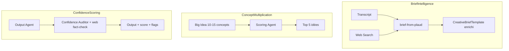

# Pipeline Smart V3 — Brief Intelligence, Concept Multiplication, Confidence Scoring

**Source unique** : ce fichier dans le projet. Les modifs Cursor sur `.cursor/plans/` ne se rafraîchissent pas toujours ; on travaille ici.

## Vue d'ensemble

Quatre évolutions du pipeline : (1) Brief Intelligence, (2) Concept multiplication, (3) Confidence scoring + fact-checking web, (4) Affichage coûts API.



---

## Phase 1 — Brief Intelligence

**Objectif** : Enrichir le brief avec des données marché/concurrence extraites du web et une segmentation cible plus fine.

### 1.1 Nouvelle route `/api/brief-research`

- **Input** : `{ rawTranscript: string }` ou `{ marque: string, secteur?: string, concurrentsMentionnes?: string[] }`
- **Comportement** : Appel Claude avec outil `web_search` pour requêtes ciblées
- **Output** : `{ landscapeConcurrentiel: string, tendancesMarche?: string[], sources?: string[] }`

### 1.2 Modification de `brief-from-plaud`

- Option A (recommandée) : **2 étapes séquentielles** — brief-research puis brief enrichi
- Option B : tools dans brief-from-plaud (plus complexe)

### 1.3 Schéma `CreativeBriefTemplate` enrichi

- `competitiveLandscape?`, `targetSegments?`

### 1.4 Affichage dans DocumentModal

- Sections `competitiveLandscape` et `targetSegments` dans CreativeBriefView.

---

## Phase 2 — Concept Multiplication

**Objectif** : 10-15 concepts, scoring, top 5 proposés.

### 2.1–2.5

- Big Idea en JSON, 10-15 idées
- Agent Scorer
- IdeaCards avec scores

---

## Phase 3 — Confidence Scoring + Fact-checking web

**Objectif** : Score 0-100 + flags. **Option B : fact-checking web** — l'Auditor valide les faits via web search.

### 3.1 Agent Confidence Auditor (avec web fact-checking)

- **Déclenchement** : Fin phase 2, avant assemblage. **Indépendant du Devil**.
- **Stratégie** :
  1. **Analyse textuelle** : flags classiques ([À COMPLÉTER], [HYPOTHÈSE], etc.)
  2. **Fact-checking web** : `web_search` sur Stratège (marché, concurrence, chiffres) et Architecte (positionnement, promesse)
  3. **Flags additionnels** : `[FAIT NON VÉRIFIÉ]`, `[DÉPASSÉ]`, `[CONTREDIT PAR SOURCES]`, `[OK - SOURCES]`
  4. **Score ajusté** selon résultat fact-check
- **Outils** : `web_search_20260209`

### 3.2 Schéma `CreativeStrategyReport` étendu

```typescript
confidence?: {
  strategist?: { score: number; flags: string[]; factCheck?: string };  // factCheck = résumé vérif web
  architect?: { score: number; flags: string[]; factCheck?: string };
  copywriter?: { score: number; flags: string[] };
  devil?: { score: number; flags: string[] };
};
```

### 3.3 Affichage

- Badge confiance sur chaque onglet.
- Pour Stratège et Architecte : afficher `factCheck` si présent.

---

## Phase 4 — Affichage des coûts API

**Objectif** : Afficher le coût de génération sur chaque document (brief, strat, SMM, etc.).

### 4.1 Schéma `_meta.generationCost`

```typescript
_meta?: {
  generationCost?: { inputTokens: number; outputTokens: number; estimatedUsd: number };
};
```

### 4.2 APIs à modifier

- `brief-from-plaud`, `smm-brief` : capturer `message.usage`
- `creative-board` : `stream.finalMessage()` après chaque agent, cumuler
- `web-section-rewrite`, `homepage`, `web-architect` : idem

### 4.3 Affichage

- Badge discret (~0.02 $) dans le header DocumentModal, à côté de la date.

---

## Ordre d'implémentation recommandé

1. **Phase 3 (Confidence)** — Le plus isolé
2. **Phase 2 (Concept multiplication)**
3. **Phase 1 (Brief Intelligence)**
4. **Phase 4 (Coûts API)** — Transversal

---

## Points d'attention

- **Coût API** : +2-3 appels/brief, +1-2/board. Auditor fact-check : +1-3 recherches.
- **Web search** : Réutiliser `web_search_20260209` pour brief-research et Auditor.
- **Rétrocompat** : Champs optionnels, fallback.
